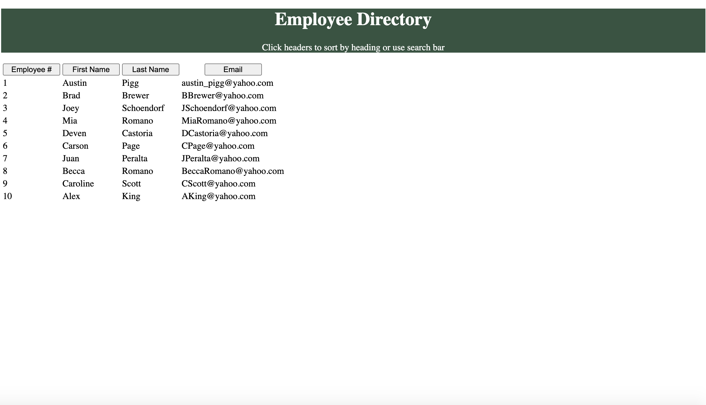

# 19-user-directory

## Description

* In this project we had to create a page with react containing a table that you could sort or filer.

## Dependencies used:

* axios
* bootstrap
* path
* react
* react-bootstrap
* react-dom
* react-router-dom
* react-scripts
* react-table
* to-case

## Link to Repository

* https://github.com/alp13097/19-user-directory

## Link to Deployed Application

* https://userdirectory19.herokuapp.com/

## Screenshots

